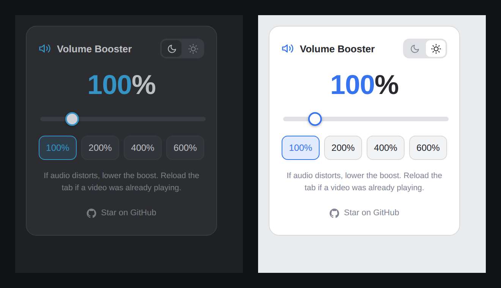

# 🔊 Volume Booster

A lightweight, privacy-respecting browser extension that boosts the volume of any audio or video tab **beyond 100%** — up to 600%. Perfect for quiet videos, low-volume recordings, or calls where the source audio just isn't loud enough.

Works on **Chrome** and **Brave** (and any other Chromium-based browser).



---

## ✨ Features

- **Boost up to 600%** — push past the browser's normal 100% ceiling.
- **Lower volume too** — drag below 100% to make a tab quieter than the source allows.
- **Slider + quick presets** — fine control, or one tap for 100% / 200% / 400% / 600%.
- **Two themes** — *Islands Darcula* (dark) and *Islands Light*, inspired by JetBrains IDEs. Toggle with the moon/sun switch; your choice is remembered.
- **Per-tab memory** — each tab keeps its own boost level.
- **No tracking, no accounts, no data collection.** Everything runs locally in your browser.

---

## 📦 Installation (Load Unpacked)

This extension isn't on the Chrome Web Store yet, so you install it manually. It takes about 30 seconds.

1. **Download** this repository — click the green **Code** button → **Download ZIP** — then unzip it. (Or `git clone` it.)
2. Open your browser's extensions page:
   - Chrome: `chrome://extensions`
   - Brave: `brave://extensions`
3. Turn on **Developer mode** (toggle in the top-right corner).
4. Click **Load unpacked**.
5. Select the **`volume-booster`** folder (the one containing `manifest.json`).

That's it — pin the icon to your toolbar and you're ready.

> ⚠️ **Keep the folder where it is.** The browser loads the extension directly from that folder, so don't delete or move it after installing.

---

## 🎚️ How to Use

1. Open any tab with a video or audio playing.
2. Click the **Volume Booster** icon.
3. Drag the slider or tap a preset to set your boost level.

**Tips**
- If a video was already playing **before** you opened the popup, reload the tab once so the booster can hook into the audio.
- If the audio sounds distorted (crackling), lower the boost — that's clipping from pushing the source past its limit, not a bug.
- For just making quiet videos audible, **150–250%** is usually plenty.

---

## 🔒 Privacy

Volume Booster collects **nothing**. It has no servers, no analytics, and no network requests. The only thing it stores is your last volume setting and theme preference — saved locally in your browser via `chrome.storage`.

---

## 🛠️ How It Works

The extension uses the Web Audio API. When you set a boost level, it grabs the page's `<video>` and `<audio>` elements, routes them through a [`GainNode`](https://developer.mozilla.org/en-US/docs/Web/API/GainNode), and amplifies the signal. A `MutationObserver` watches for media added to the page later (e.g. when you click a new video) so it keeps working without a reload.

It's all plain JavaScript — no build step, no dependencies. Feel free to read every line.

```
volume-booster/
├── manifest.json     # Extension config (Manifest V3)
├── popup.html        # The UI (Islands-themed)
├── popup.js          # UI logic + audio boosting
├── background.js     # Cleans up stored settings when tabs close
├── icon.svg          # Icon source
└── icons/            # Rendered PNG icons (16/32/48/128)
```

---

## 🤝 Contributing

Issues and pull requests are welcome. If you find a bug or have an idea, open an issue.

If you find this useful, **⭐ star the repo** — it helps others discover it!

---

## 📄 License

Licensed under [Creative Commons Attribution-NonCommercial 4.0 (CC BY-NC 4.0)](LICENSE).

You're free to use, modify, and share it — just **give credit** and **don't use it commercially**. See the [LICENSE](LICENSE) file for details.
